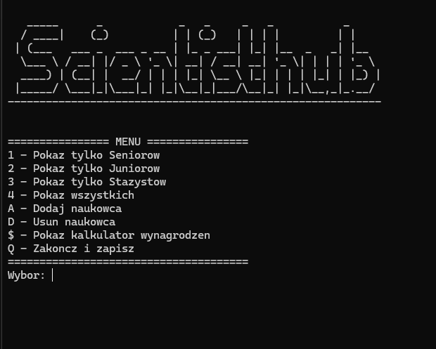

# Scientific Team Manager (C++)

A comprehensive backend system designed for managing academic staff and research data. This project demonstrates advanced **Object-Oriented Programming (OOP)**, implementation of **Design Patterns**, and robust data management in C++.

### 🚀 Key Features
- **Dynamic Staff Management:** Add, delete, and browse employees categorized by academic ranks (Trainee, Junior, Senior).
- **Academic Metrics:** Automated calculation of the **Hirsch Index (h-index)** based on citation counts and academic rank.
- **Salary Calculator:** Complex salary logic factoring in base pay, performance scores, ministerial points, and years of experience].
- **Data Persistence:** Full support for saving and loading data from text files, ensuring long-term storage of the researcher database.

### 🛠 Technical Architecture
The system is built on a solid foundation of clean code and modern C++ standards:

| Component | Technical Implementation |
| :--- | :--- |
| **Hierarchy** | Abstract base class `Employee` with polymorphic specialized ranks. |
| **Creation** | **Factory Pattern** via `ResearcherFactory` for decoupled object instantiation. |
| **Memory** | Smart pointers (`std::unique_ptr`) for safe resource management and RAII compliance. |
| **Logic** | Custom **I/O Streams** for robust data serialization/deserialization. |
| **UI** | Interactive Command Line Interface (CLI) with ASCII-art design. |

### 🖥️ User Interface
The application features a structured CLI menu for intuitive navigation:
* **1-3:** Filter researchers by rank.
* **4:** Show all employees.
* **A/D:** Add or Delete entries.
* **$:** Access the Salary Calculator documentation.
* **Q:** Save database and exit.

  
 

### 📄 Documentation
Project includes comprehensive technical documentation generated via Doxygen.
While comments are in Polish (original academic requirements), the codebase follows strict English naming conventions and SOLID principles.
👉 **[View Technical Documentation (PDF)](./Doxygen/refman.pdf)**
