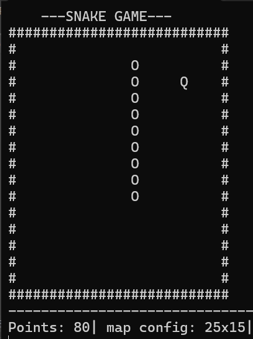

# Snake Game - Advanced C++ Implementation

## 📝 Project Overview
This is a modern take on the classic Snake game, developed as a technical project for the Computer Science curriculum at the **Silesian University of Technology**. The project focuses on high-performance memory management, advanced data structures, and the "Rule of Five" in C++.

## 🚀 Key Technical Features
* **Custom Bidirectional Linked List**: Managed using `std::unique_ptr` for automatic ownership and memory safety.
* **Move Semantics (Rule of Five)**: Full implementation of copy/move constructors and assignment operators with `noexcept` specifications for optimal performance.
* **Smart Pointers**: Utilizing `std::unique_ptr` to ensure zero memory leaks and clean resource management.
* **Difficulty Scaling**: Features dynamic gameplay mechanics (speed and map size scaling) for EASY, MEDIUM, and HARD modes.
* **Data Persistence**: High-score serialization and leaderboard system using file I/O operations.
* **Sorting Algorithm**: Custom implementation of the Bubble Sort algorithm to sort internal data structures.

## 🛠 Project Structure
* `SnakeList`: Core data structure managing the snake's body segments.
* `GameConfig`: Handles external configuration loading (`config.txt`).
* `SaveHighScore`: Manages player records and leaderboard display (`highscore.txt`).
* `Draw`: flicker-free rendering system using Windows Console API.

## 📖 Documentation
The project includes comprehensive technical documentation generated via **Doxygen**.

➡See [Documentation](./docs/refman.pdf)

## 🖥️ How to Build and Run

1.  **Requirements**: A C++17 compliant compiler (e.g., MSVC, GCC).
2.  **Compilation**: Open the project in your preferred IDE (Visual Studio recommended) and build the solution.
3.  **Config**: Ensure `config.txt` is located in the executable's directory.
4.  **Controls**: 
    * `W`, `A`, `S`, `D` – Movement
    * `X` – Quit game
  
## 🕹️ Dynamic Difficulty Scaling
The game implements a sophisticated difficulty system that goes beyond simple speed increases, affecting both the environment and scoring mechanics:

* **EASY**: Standard snake experience. snake grows after eating fruit with constant speed and map size.
* **MEDIUM**: Increased challenge – each fruit consumed increases the snake's speed.
* **HARD**: Extreme mode – higher speed acceleration combined with dynamic map shrinking, reducing the playable area after every consumed fruit.
  
      

## 🎓 Academic Requirements Compliance
This project fulfills all laboratory requirements, including:
*  Custom implementation of a dynamic data structure.
*  Implementation of Move Semantics.
*  Manual sorting method.
*  Use of Smart Pointers and modern C++ standards.

---
**Author**: Mikołaj Jussak
**Field of Study**: Computer Science, Silesian University of Technology
